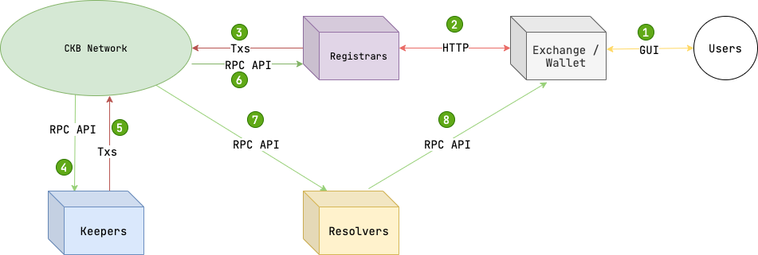
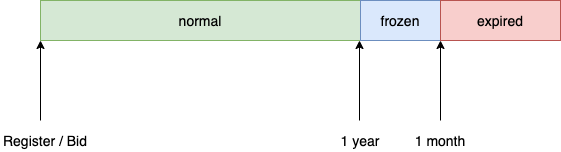

# Overview of DAS

DAS is short for Decentralized Account System. This document is an overview of the design of it. It is mainly about how the system works and how the modules communicate with each other.

## Big Picture

The whole DAS is running around a blockchain named [CKB](https://www.nervos.org/), but first, let's look at a more understandable registration scenario to get a global picture of how DAS works:

1. At the first, users need to access the **Registrars** of DAS through the browser in exchange or wallet.
2. A **Registrars** can be a web service implemented by anyone that provides users with DAS registration functionality, but of course it is not limited to web services, any application that helps users complete on-chain interactions and obtain an account can be called a **Registrars**.
3. **Registrars** convert users' registration requests and various other operations into transactions, then push transactions after users signed through any wallet application.
4. **Keepers** are decentralized DAS node that keep monitoring transactions on CKB via JSON RPC of CKB node；
5. When user transactions are found that need to be processed, specific transactions will be created in accordance with [Transaction Structure](Data-Structure-and-Protocol/Transaction-Structure.md) to complete user request such as account registration.
6. If the **Registrars** is well developed, it can monitor the user's account registration and other status through the CKB node's  JSON RPC, and provide timely feedback to the user.
7. Once the user has registered a account successfully and set up some records, **Resolvers** can parse on-chain blocks for data via CKB node's JSON RPC.
8. Finally, **Resolvers** provides the data through its own RPC interface to wallets, exchanges, and other applications that need to use the records of user.

## Uniqueness of Account and Registration Process

After the account registration process described above, one of the core assets in DAS, the DAS account, is created. Its core value is uniqueness, and the key to understanding the uniqueness of DAS accounts lies in understanding the registration process of DAS accounts, so here is a brief overview of the registration process, as shown in the following diagram

- First of all, users need to apply for registration, at this step, the user's account name is hashed and keep secret, about  the design and principle are detailed in [Anti-robbery of Account](Anti-robbery-of-Account/Anti-robbery-of-Account.md).
- After a certain period of time, the user can push a pre-register transaction by providing the plain account name.
- If a **Keeper** found the pre-register transaction it will check the uniqueness of the account name and create a proposal with proof of uniqueness for the account name, then push a transaction contains the proposal.
- Finally, after waiting for some time, the **Keeper** can confirm the proposal and complete the registration of the new account, see [Account Chain](Account-Chain/Account-Chain.md) for details of the design.

Each step above corresponds to a transaction, if you want to understand them in depth, please see [Transaction Structure](Data-Structure-and-Protocol/Transaction-Structure.md)

## Account On-Chain Structure

After the account is successfully registered, the account data will be saved on blockchain in a cell, and all cells can eventually form **a one-way ordered linked list**, which is also the proof of uniqueness in the account registration process:

### Account Management

The use of the account can be divided into two categories: one is the write operation to modify the account through transactions, and the other is the read operation to read the account information by parsing its data.

For write operations, in addition to understanding the data structure of the account you must also understand the various transactions of account, such as:

- [TransferAccount](Data-Structure-and-Protocol/Transaction-Structure.md#TransferAccount)
- [EditManager](Data-Structure-and-Protocol/Transaction-Structure.md#EditManager)
- [EditRecords](Data-Structure-and-Protocol/Transaction-Structure.md#EditRecords)
- [RenewAccount](Data-Structure-and-Protocol/Transaction-Structure.md#RenewAccount)

For read operations, you only need to understand the data structure of the AccountCell, for details please see [Cell Structure](Data-Structure-and-Protocol/Cell-Structure.md) .

### Account Lifecycle

One factor that should always be kept in mind when reading or writing an account is the **account lifecycle**:

Each status of lifecycle in the above diagram are:

- **Normal status**, after user registered an account and pay its annual fee regularly, the account will stay in this status.
- **Frozen status**, if user do not pay annual fee of an account in time, the account will be frozen temporarily. All write operations will be denied by contract script, but all read operations are still available cause contract script can not affect off-chain actions. So **It is recommended for any applications base on DAS that clear warnings and alerts must be given for accounts with this status**.
- **Expired status**, When an account has not been renewed beyond the frozen period, it will become expired status. Then keepers can recycle the account at any time, **and the account will no longer exist on blockchain once it has been recycled**.

Due to the nature of the CKB chain, the actual time which determine the account's status is dependent on a special cell called TimeCell. **Note that the time provided by TimeCells has about few minutes offset with real world time, but it is still sufficient as a reference value for the time on-chain. **

### Records

Records are the most important data for each account, and basic application scenarios such as daily transfers and identification are built on them. There is no explicit limit on the number of records for a single account, but there is an upper limit on the total record size due to contract cycle limits and the signall lock script's size limit on `witnesses`. Each record contains the following fields:

- `type` field is type of record and must currently be one of `address, profile, custom_keys`.
- `key` field is key of record, there are different keys that can be used depending on `type`, such as btc, eth, email, etc.
- `label` field is user-defined naming for records.
- `value` field is value of record, contract script will not verify address or email format, application must verify them off-chain.
- `ttl` field is the recommended expiration date of the record cache in seconds，each level of applications should update their cache base on this value in time.

> At the front-end interface level, `type` and `key` are combined into a single `key` for the sake of brevity, separated by a `.` symbol.

## Take Part in DAS

Just like what you see in [Big Picture](#big-picture)，anyone can take part in DAS through becoming one of the role in its ecosystem:

- User is the easiest kind of role to be, you can sign up for a personal account now by visiting https://da.systems/ .
- Exchange/Wallet is usually played by a professional team or company that is already doing this type of business.
- Registrar is the role need to resolve payment problems for users, and implement on-chain transactions base on [Transaction-Structure/Register-Transactions](Data-Structure-and-Protocol/Transaction-Structure.md#register-transactions) .
- Keeper , because some of performance issues, is still not open source, but remember that DAS is a decentralized application. The keeper is just a server which works under DAS protocol to build transactions, and anyone can implement a server like that. If you are willing to develop a keeper you need to understand both [Cell-Structure](Data-Structure-and-Protocol/Cell-Structure.md) and [Transaction-Structure](Data-Structure-and-Protocol/Transaction-Structure.md) deeply.
- Resolver is a role easier to be，it just need to run open sourced [resolver code](https://github.com/DeAccountSystems/das_account_indexer). But there is no gain for this role, and exchange/wallet only trust their own resolvers, so it is not recommended to run this service alone.

No matter which of the above roles you want to be in the DAS ecosystem, we are always happy to help you with any technical questions on our Discord group, you can find the invite link on our official site. 🤝
