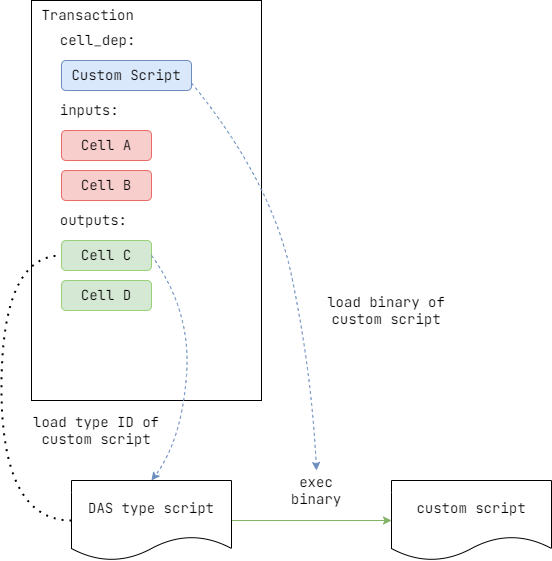

# User Script Loading Mechanism

Considering that users' needs are constantly changing and the DAS team's development resources are limited, a mechanism has been designed to allow users to extend the verification logic according to their own needs while using DAS.

## Principle

Based on the research results of the existing CKB ecosystem, the [exec](https://github.com/nervosnetwork/rfcs/blob/master/rfcs/0034-vm-syscalls-2/0034-vm-syscalls-2.md#exec) proposal with high feasibility and usability was finally adopted. This proposal has the following advantages:

- It supports any contract developed based on Capsule, providing developers with a basic development environment and deployment tools.
- Since Capsule supports development in C or Rust, developers can choose to develop in Rust, which has clearer semantics.
- The cycle cost of calls is constant, and the cycle cost of passing parameters grows linearly, so the cost is entirely acceptable.

At the same time, this proposal also has the following limitations:

- After contract script A calls contract script B, contract script A will exit completely. Therefore, the statement calling script B must be the last line of contract script A.
- As mentioned above, it cannot be guaranteed whether B will callback to A, i.e., A cannot guarantee that it will get the return value of B.
- When contract script A calls contract script B, the type of parameters passed must be a CStr array, i.e., a string byte with `0x00` as the terminator.

## Solution

As shown in the figure, assuming `Cell C` carries a type script that supports loading custom scripts, the type script will try to find the type ID of the required custom script to load from the data information of `Cell C` when it is running. Once the type ID is successfully obtained, it will attempt to load the custom script using [ckb_exec](https://github.com/nervosnetwork/rfcs/blob/master/rfcs/0034-vm-syscalls-2/0034-vm-syscalls-2.md#exec).

### Parameter Structure

As stated in the principle, when loading custom scripts, CStr arrays can be passed as parameters. Therefore, the following conventions for parameter structures are established:

- Parameter 1 is always a string representing the function name, such as `verify_payment`, and the custom script should implement a call to this function.
- Parameters 2 to n always represent other parameters passed to the function, with specific values depending on the function.
- For parameters 2 to n, when binary data needs to be passed, it should be converted to a hex string for transmission. This can avoid the limitation of not being able to use the `0x00` character.
