As shown in the figure above, the .bit registration process mainly includes the following steps:
- Apply for registration, corresponding transaction apply_register;
- Pre-registration, corresponding transaction pre_register;
- Propose pre-registration information and corresponding transactions propose, confirm_proposal;

### Proposal iteration process
Since there are broadcast and confirmation times for transactions on the chain, and in terms of design, we hope that proposals can be continuously uploaded to the chain, so we have an iterative process design for proposals. Simply put, it allows new proposals to be created when old proposals are not confirmed and begin to wait for broadcast, so that ideally each block can contain one proposal to achieve maximum traffic.
The logic has not been implemented yet because of the complexity of its implementation and the fact that the current volume of registrations is not causing any issues.

### Conflict Decision Process of Proposal
For the scenario where multiple keepers on the chain create proposals in parallel at the same time, if there is no intersection of the accounts involved in the proposal, there will be no conflict, but if there is intersection of the accounts involved, there will be a conflict, so we have given the following practical guidance on the design. However, due to the open source nature of the keeper, third-party keepers may not make conflict decisions according to the following logic.
This process is the business logic of the off-chain keeper, so no related code will be found in the contract, and the on-chain execution environment is a deterministic single-threaded environment for the contract, so there is no need to implement the related logic.

